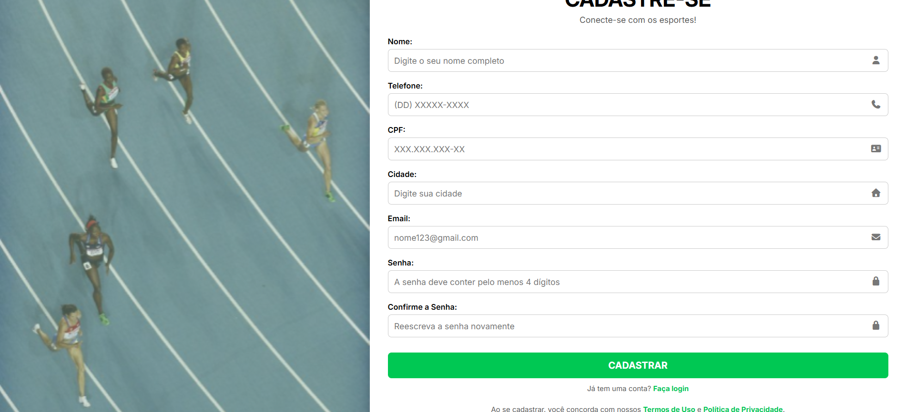
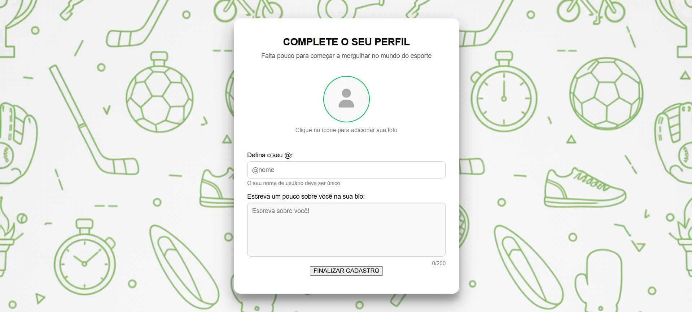
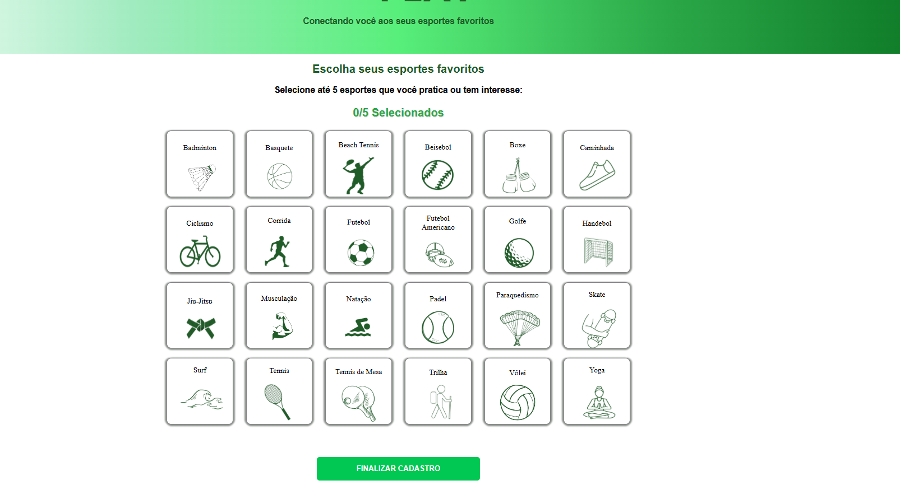
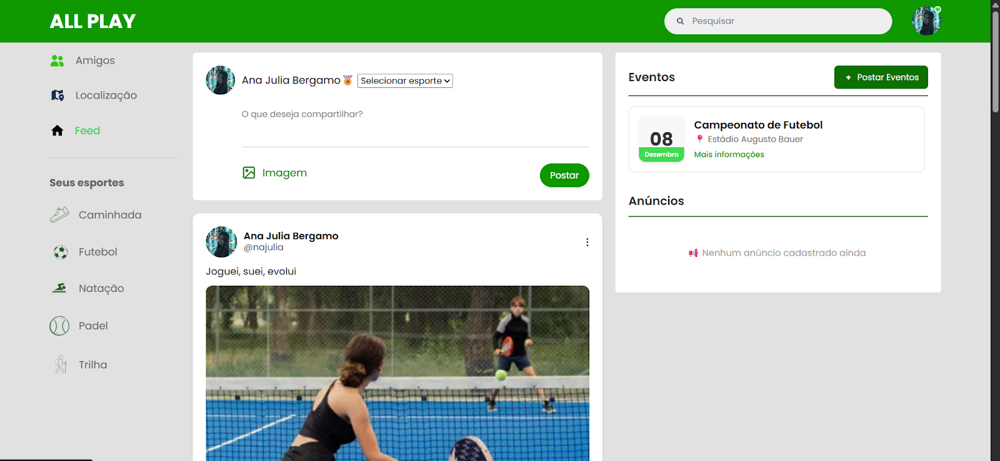
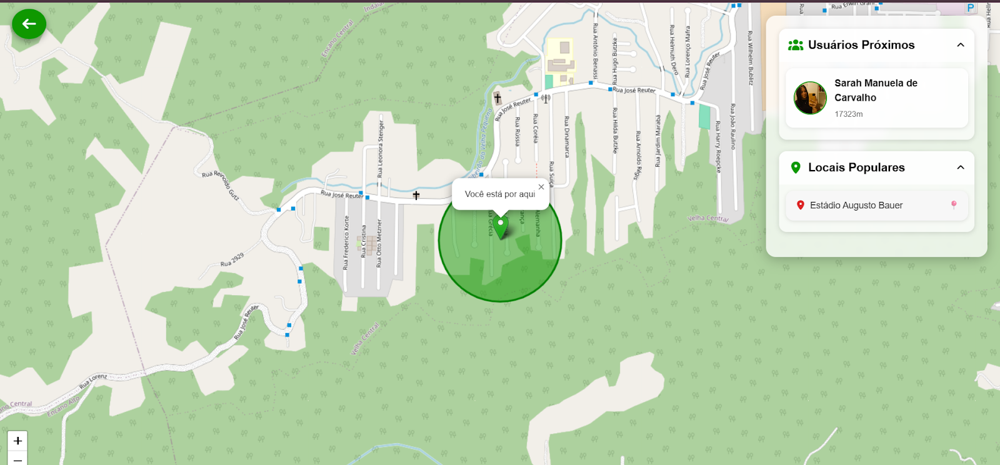
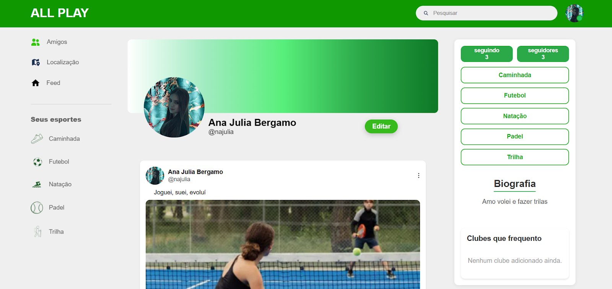

## All Play
O **All Play** é uma aplicação web voltada para a criação e fortalecimento de **comunidades esportivas com base na localização do usuário**.  
Seu principal objetivo é conectar atletas de diferentes modalidades, facilitando encontros, interações e a divulgação de conquistas esportivas.

Na plataforma, os usuários podem compartilhar publicações escritas, fotos, criar eventos esportivos e interagir com outros atletas, academias e clubes próximos à sua região.

Ao acessar o sistema pela primeira vez, o usuário escolhe até **5 esportes principais**, que serão usados para personalizar o feed de conteúdo. Também é possível filtrar o feed por modalidade, visualizar apenas um esporte específico e gerenciar suas preferências ao longo do tempo.

Além disso, o All Play permite:
- Adicionar amigos
- Editar o perfil do usuário
- Buscar academias e clubes próximos
- Criar e participar de eventos esportivos

---

## Telas do Projeto

## 1. Tela Inicial


## 2. Tela de Cadastro

A tela de cadastro é dividida em três partes:

## Parte 1:


Consiste em completar seus dados pessoais, e a informação mais importante: A localização, que é o que vamos usar no mapa.

## Parte 2:


[Descrever]

## Parte 3:


[Descrever]

## Tela Inicial - FEED



## Tela de Localização



## Tela Perfil do Usuário



## Instrução de Instalação

```bash
npm install mysql2
node js
npm install express
```

## Instrução de uso
Para abrir o site no navegador, basta ter o banco de dados MySQL, clonar o repositório e digitar os seguintes comandos:

```bash
cd front-ent
node appbanco.js
```